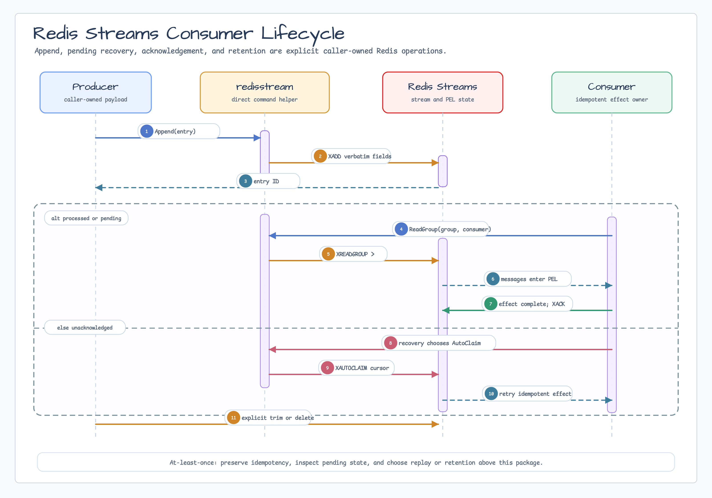

# redis/stream

[English](README.md) | [한국어](README.ko.md)

`github.com/bluetape4k/bluetape-go/redis/stream`은 직접 호출하는 typed Redis
Streams command helper를 제공합니다. Package 이름은 `redisstream`입니다.



## 범위

이 package는 message broker, consumer framework, `go-redis` facade가 아닙니다.
Connection, retry, logger, metric, background goroutine, payload encoding,
consumer topology, retention policy를 소유하지 않습니다. Redis client와 모든
deadline은 caller-owned입니다.

Helper는 다음 Redis command에 직접 대응합니다.

- `Append` (`XADD`)
- `Read` (`XREAD`)
- `CreateGroup` (`XGROUP CREATE ... MKSTREAM`)
- `ReadGroup` (`XREADGROUP`)
- `Acknowledge` (`XACK`)
- `Pending` (`XPENDING` detail)
- `AutoClaim` (`XAUTOCLAIM`)
- `TrimMaxLen`, `TrimMinID`, `Delete`

Name, ID, field key, value, `go-redis` command option은 caller-owned입니다.
Blank structural name은 거부하지만 유효한 name은 Redis에 그대로 전달합니다.
`Read`와 `ReadGroup`은 go-redis의 stream layout, 즉 모든 stream key 뒤에 각
stream의 ID를 하나씩 두는 형식을 사용합니다.

## Append

Caller-owned timeout을 사용하고 payload encoding은 호출 지점에서 선택합니다.

```go
ctx, cancel := context.WithTimeout(parent, time.Second)
defer cancel()

id, err := redisstream.Append(ctx, client, redis.XAddArgs{
	Stream: "orders",
	Values: map[string]any{
		"event_id": "evt-42",
		"kind":     "created",
	},
})
```

`XAddArgs.MaxLen`, `MinID`와 관련 trim setting은 caller가 제공한 그대로
전달됩니다. Package가 retention을 암묵적으로 적용하지 않습니다.

## Consumer Group과 Recovery

Redis Streams consumer group은 at-least-once입니다. Process가 effect를 완료한
뒤 `Acknowledge` 전에 실패할 수 있고, Redis가 command를 accept한 뒤 timeout이
발생할 수도 있습니다. Consumer는 `event_id` 같은 안정적인 application identity로
effect를 idempotent하게 만들어야 합니다.

```go
if err := redisstream.CreateGroup(ctx, client, "orders", "billing", "0"); err != nil {
	return err // existing group을 허용할지 caller가 결정합니다
}

streams, err := redisstream.ReadGroup(ctx, client, redis.XReadGroupArgs{
	Group:    "billing",
	Consumer: "billing-1",
	Streams:  []string{"orders", ">"},
	Count:    10,
})
```

`ReadGroup`은 `NoAck`가 아니면 pending entry를 만듭니다. Idempotent effect가
완료된 뒤에만 acknowledge하세요. `Acknowledge`는 해당 group의 pending record를
제거할 뿐 stream entry를 delete하지 않습니다.

Recovery candidate는 `Pending`으로 검사합니다. `AutoClaim`은 message와 다음 Redis
cursor를 반환합니다. Cursor를 저장하거나 계속 스캔하는 정책은 caller의 책임입니다.
Package가 idle threshold 선택, work steal, effect retry를 자동으로 수행하지 않습니다.

Consumer를 중지할 때는 read를 중지하고, in-flight idempotent work를 완료 또는
기록하며, 완료된 effect만 acknowledge하고, 나머지는 제어된 recovery를 위해 pending으로
남겨 두세요.

## Retention과 Replay

`TrimMaxLen`, `TrimMinID`, `Delete`는 명시적인 destructive command입니다. Slow
consumer 또는 incident replay에 필요한 history를 없앨 수 있습니다. Consumer lag,
pending entry, replay requirement를 고려한 뒤 retention을 선택하세요. `Delete`는
acknowledge를 대체하지 않으며 선택한 stream entry만 제거합니다.

## Error와 Runbook

이미 canceled 또는 expired된 context는 Redis dispatch 전에 그대로 반환됩니다.
Dispatch된 Redis failure는 `*btredis.OpError`로 반환됩니다. Formatted text에는
low-cardinality operation과 redacted stream-key correlation ID만 포함되고 raw stream
name이나 provider error text는 포함되지 않습니다. Cause는 `errors.Is`와 `errors.As`로
검사하세요.

Dispatch 뒤 context가 만료되면 command commit state는 indeterminate입니다. Effect가
없었다고 가정하지 말고 stream/group state를 확인하거나 idempotent workflow로 retry하세요.

운영 점검:

- `context.Canceled` / `context.DeadlineExceeded`: caller timeout path입니다.
  Command가 Redis에 도달했을 수 있으면 Redis state를 확인합니다.
- `*btredis.OpError`: unwrap cause와 redacted key ID를 확인합니다. Error string에서
  raw key를 재구성하거나 log에 남기지 마세요.
- Pending entry 증가: retention을 늘리거나 history를 delete하기 전에 unhealthy consumer,
  idempotency, `AutoClaim` policy를 점검합니다.
- Replay: 명시적인 `Read`/`ReadGroup` ID와 bounded service-owned procedure를
  사용합니다. 이 package는 replay를 스스로 시작하지 않습니다.

## 검증

Redis integration test는 Docker가 필요합니다.

```bash
go test -p 1 -count=1 ./redis/stream
go test -p 1 -race -count=1 ./redis/stream
go test -count=1 ./redis/stream -run Example
```

이 issue에서는 benchmark를 수행하지 않습니다. Provider benchmark result table,
chart, written analysis는 issue #560이 소유합니다.
