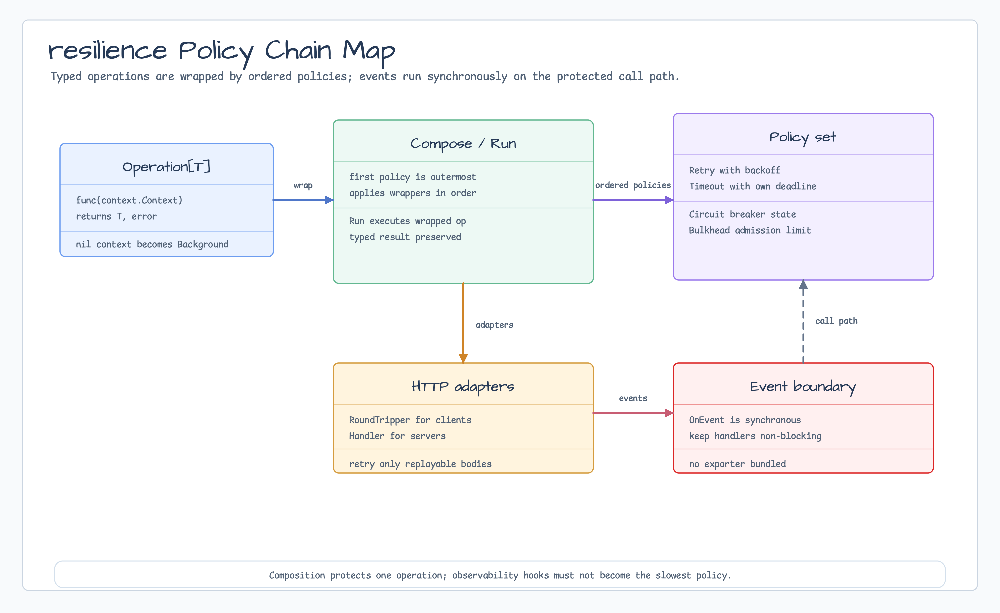

# resilience

[English](README.md) | [한국어](README.ko.md)

`resilience` provides first-party retry, timeout, circuit breaker, and bulkhead
policies for service calls. Policies compose around typed operations and expose
synchronous event hooks for logging, metrics, or tracing bridges.

## Diagram



## Import

```go
import "github.com/bluetape4k/bluetape-go/resilience"
```

## Usage

```go
retry, err := resilience.NewRetry[string](resilience.RetryOptions{
    Name:        "catalog",
    MaxAttempts: 3,
    Backoff:     resilience.ConstantBackoff(50 * time.Millisecond),
})
if err != nil {
    return err
}

timeout, err := resilience.NewTimeout[string](resilience.TimeoutOptions{
    Name:    "catalog",
    Timeout: time.Second,
})
if err != nil {
    return err
}

value, err := resilience.Run(ctx, loadCatalogValue, retry, timeout)
```

## HTTP Adapters

```go
client := http.Client{
    Transport: resilience.NewRoundTripper(resilience.RoundTripperOptions{
        Transport:       http.DefaultTransport,
        Policies:        []resilience.Policy[*http.Response]{retryPolicy, timeoutPolicy},
        RetryableStatus: resilience.RetryableServerError,
    }),
}
```

Server handlers can be wrapped with `NewHandler` for admission or timeout
policies. Prefer retries on outbound client calls where the request body is
replayable.

## Behavior

- `Compose` applies the first policy as the outermost wrapper.
- Retry predicates can reject errors that should not be retried.
- Timeout distinguishes its own deadline from parent context cancellation.
- Circuit breaker transitions between closed, open, and half-open states.
- Bulkhead limits concurrent admissions and can reject or wait according to
  options.
- `OnEvent` handlers run synchronously on the protected call path.

## slog Bridge

Applications configure `log/slog` handlers and pass package-local bridges
through `OnEvent`. The library does not mutate global logging defaults or own a
logger registry.

The snippet assumes standard imports such as `context`, `log/slog`, and `time`.
The compile-checked version lives in
[`resilience_example_test.go`](resilience_example_test.go).

```go
logger := slog.Default()
retry, err := resilience.NewRetry[string](resilience.RetryOptions{
    Name:        "catalog",
    MaxAttempts: 3,
    Backoff:     resilience.ConstantBackoff(50 * time.Millisecond),
    OnEvent: func(ctx context.Context, event resilience.Event) {
        logger.LogAttrs(ctx, slog.LevelInfo, "resilience event",
            slog.String("policy", event.PolicyName),
            slog.String("policy_type", event.PolicyType),
            slog.String("kind", string(event.Kind)),
            slog.String("category", string(event.Category)),
            slog.Int("attempt", event.Attempt),
            slog.Duration("delay", event.Delay),
            slog.String("error_category", string(event.ErrorCategory)),
        )
    },
})
```

## Operational Boundaries

- The package does not include an OpenTelemetry exporter.
- If an application wants `slog` records exported through OpenTelemetry, wire
  the official `go.opentelemetry.io/contrib/bridges/otelslog` handler in
  application setup and pass the resulting `slog.Logger` through `OnEvent`.
- Keep event handlers fast and non-blocking.
- Filter or sample high-volume success events before logging them from
  synchronous hooks.
- Applications own `slog` handler configuration. This package only emits
  caller-owned synchronous events.
- HTTP retry requires replayable request bodies.

## Test

```bash
go test -count=1 ./resilience
```
