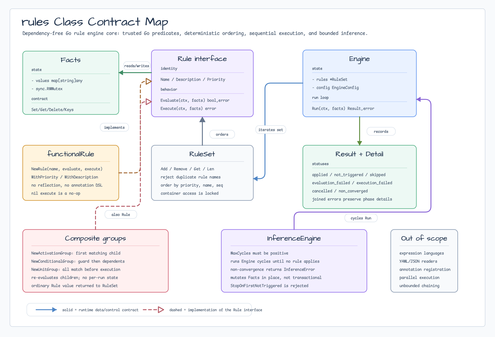

# rules

[English](README.md) | [한국어](README.ko.md)

`rules`는 일반 Go application을 위한 dependency-free deterministic rule-engine
primitive를 제공합니다. Scope는 의도적으로 작습니다. Facts, rule contract, rule
set, composite group, bounded inference, sequential execution, result detail,
typed error, context cancellation을 다룹니다.

Root package는 expression language, YAML/JSON reader, annotation-style
registration, parallel execution, unbounded forward chaining을 포함하지
않습니다. YAML/JSON reader는 이 core 위에 쌓는 optional subpackage에 둡니다.

Rule은 trusted Go code입니다. Context cancellation은 cooperative합니다. Engine은
각 evaluation과 execution 전에 context를 확인하며, rule body도 전달받은
context를 존중해야 합니다.

## 가져오기

```go
import "github.com/bluetape4k/bluetape-go/rules"
```

## 아키텍처

이 diagram은 bluetape4k `utils/rule-engine` README diagram의 core rule-engine
용어를 따르되, 현재 Go package의 범위로 의도적으로 좁혔습니다. Kotlin DSL,
annotation adapter, script reader, suspend engine, parallel execution은 이
package의 일부가 아닙니다. Go caller는 ordinary `Rule` value를 조합하고
deterministic sequential engine으로 실행합니다.



## 예제

Compile-checked 예제는 [`rules_example_test.go`](rules_example_test.go)에
있습니다.

```go
import (
    "context"
    "fmt"

    "github.com/bluetape4k/bluetape-go/rules"
)

func applyDiscount(ctx context.Context) error {
    facts := rules.NewFacts()
    _ = facts.Set("amount", 120)

    discount, err := rules.NewRule(
        "discount",
        func(_ context.Context, facts *rules.Facts) (bool, error) {
            value, ok := facts.Get("amount")
            if !ok {
                return false, nil
            }
            amount, ok := value.(int)
            return ok && amount >= 100, nil
        },
        func(_ context.Context, facts *rules.Facts) error {
            return facts.Set("discount", 10)
        },
        rules.WithPriority(10),
        rules.WithDescription("apply a threshold discount"),
    )
    if err != nil {
        return err
    }

    set, err := rules.NewRuleSet(discount)
    if err != nil {
        return err
    }
    result, err := rules.NewEngine(set, rules.EngineConfig{
        StopOnFirstFailed: true,
    }).Run(ctx, facts)
    if err != nil {
        return err
    }
    if result.Failed > 0 {
        return fmt.Errorf("rules failed: %d", result.Failed)
    }
    return nil
}
```

## Facts

`Facts`는 blank-key validation, deletion, sorted key listing, clone helper,
shallow snapshot을 제공하는 key/value container입니다.

- Container operation은 concurrent access에 안전합니다.
- 저장된 value는 caller-owned입니다. `Clone`과 `Snapshot`은 map만 복사하고 내부
  value는 deep copy하지 않습니다.
- Blank key는 `ErrBlankKey`로 거부합니다.

## Rules

Rule은 plain Go interface입니다.

```go
type Rule interface {
    Name() string
    Description() string
    Priority() int
    Evaluate(context.Context, *Facts) (bool, error)
    Execute(context.Context, *Facts) error
}
```

간단한 functional rule은 `NewRule`을 사용하세요. Reflection, annotation,
JVM-shaped DSL을 사용하지 않습니다.

## RuleSet Ordering

`RuleSet`은 duplicate rule name을 거부하고 deterministic order로 rule을 반환합니다.

1. Priority ascending.
2. Rule name ascending.
3. 완전히 같은 tie에서는 registration sequence.

## Engine

`Engine`은 rule을 sequential하게 실행하고, evaluated/applied/skipped/failed rule
마다 `Detail`을 담은 `Result`를 반환합니다.

`EngineConfig`는 다음 정책을 제공합니다.

- `StopOnFirstApplied`
- `StopOnFirstFailed`
- `StopOnFirstNotTriggered`
- `UsePriorityThreshold`와 `PriorityThreshold`

Engine은 각 evaluation 전과 execution 전에 `context.Context`를 확인합니다.
Cancellation error는 `errors.Is`로 `context.Canceled` 또는
`context.DeadlineExceeded`를 보존합니다.

Evaluation/execution failure는 result detail에 기록됩니다. `StopOnFirstFailed`가
true이면 run을 중단하고 `ErrRuleEvaluation` 또는 `ErrRuleExecution`과 호환되는
`RuleError`를 반환합니다. `StopOnFirstFailed`가 false이면 engine은 이후 rule을
계속 실행하지만 rule failure가 하나라도 있으면 joined error를 반환합니다. Rule별
failure는 `Result.Details`에서 확인하세요.

## Expr YAML/JSON Reader

`rules/exprreader`는 YAML 또는 JSON 문서를 기존 `rules.RuleSet`과
`rules.EngineConfig` contract로 compile하는 optional package입니다.

```go
import "github.com/bluetape4k/bluetape-go/rules/exprreader"
```

Schema version `1`은 `rules[].name`과 `rules[].when`을 요구합니다. 각 `when`
expression은 `expr.AsBool()`, 보수적인 `MaxNodes` 제한, undefined fact variable
허용, `WarnOnAny`, builtin 기본 비활성화 정책으로 compile합니다. Function/builtin
call node도 거부하므로 fact를 통해 전달된 callback을 expression에서 호출할 수
없습니다. 첫 action whitelist는 declarative `set`만 지원합니다.

```yaml
version: 1
rules:
  - name: high-value-discount
    priority: 10
    when: amount >= 100 && tier in ["gold", "platinum"]
    then:
      - set:
          key: discount
          value: 10
engine:
  stopOnFirstFailed: true
```

Reader loading은 decode, validation, expression compile, rule construction
전에 `context.Context`를 확인합니다. 생성된 rule은 expression evaluation과 action
execution 전에 context를 확인합니다. Predicate runtime error는 `Rule.Evaluate`로,
action error는 `Rule.Execute`로 반환하며, engine wrapping은 기존 `rules.Engine`이
담당합니다.

Typed reader error는 `errors.Is` / `errors.As`와 호환됩니다.

- `exprreader.ErrInvalidRuleDocument`
- `exprreader.ErrInvalidRuleExpression`
- `exprreader.ErrInvalidRuleAction`
- `exprreader.ReaderError`

Non-goal은 명시적으로 유지합니다. YAML/JSON에서 arbitrary Go callback 선언,
expression-backed side-effectful action, annotation/reflection registration,
HOCON, 별도 inference engine, unbounded forward chaining은 지원하지 않습니다.

## Composite Groups

Composite group은 ordinary `Rule` value입니다.

- `NewActivationGroup`은 child를 deterministic order로 평가하고 첫 번째 matching
  child만 실행합니다.
- `NewConditionalGroup`은 named guard rule을 요구하고, guard가 match될 때만
  dependent를 평가합니다. Missing 또는 duplicate guard는 거부합니다.
- `NewUnitGroup`은 모든 child가 match되어야 child execution을 시작합니다.

Child ordering은 `RuleSet`과 같습니다. Priority ascending, rule name ascending,
완전히 같은 tie에서는 registration sequence입니다. Group execution은 sequential이며
child evaluation/execution 전에 context를 확인합니다. Child predicate는
side-effect-free여야 합니다. Composite `Execute`는 group에 per-run selection
state를 저장하지 않고 child를 다시 평가합니다. 재평가에서 실행 가능한 child가 없으면
group이 적용된 것처럼 처리하지 않고 `ErrCompositeNotTriggered`를 반환합니다.

## Bounded Inference

`InferenceEngine`은 rule이 적용되지 않는 cycle에 도달하거나, context가 취소되거나,
rule이 실패하거나, `InferenceConfig.MaxCycles`를 초과할 때까지 `RuleSet`을 반복
실행합니다. `MaxCycles`는 양수여야 합니다. Non-convergence는
`ErrInferenceNonConverged`와 호환되는 `InferenceError`를 반환하고, 반환된 result의
stop reason은 `StatusNonConverged`입니다. 성공적인 최종 convergence 판단에는 rule이
적용되지 않는 추가 cycle이 필요하므로, `MaxCycles`는 최대 mutation cycle 수에
convergence 확인 1회를 더해 산정하세요. `StopOnFirstNotTriggered`는 뒤쪽 matching
rule을 숨길 수 있어 inference에서는 거부됩니다.

Inference는 전달받은 `Facts`를 in-place로 변경합니다. Transactional하지 않으므로
non-convergence 또는 rule error 전에 기록된 fact는 그대로 남습니다. 성공한 경우에만
원본 fact를 반영해야 하는 speculative run에는 `Facts.Clone`을 사용하세요.

## 테스트

```bash
go test -count=1 ./rules ./rules/...
go test -race -count=1 ./rules ./rules/...
```
