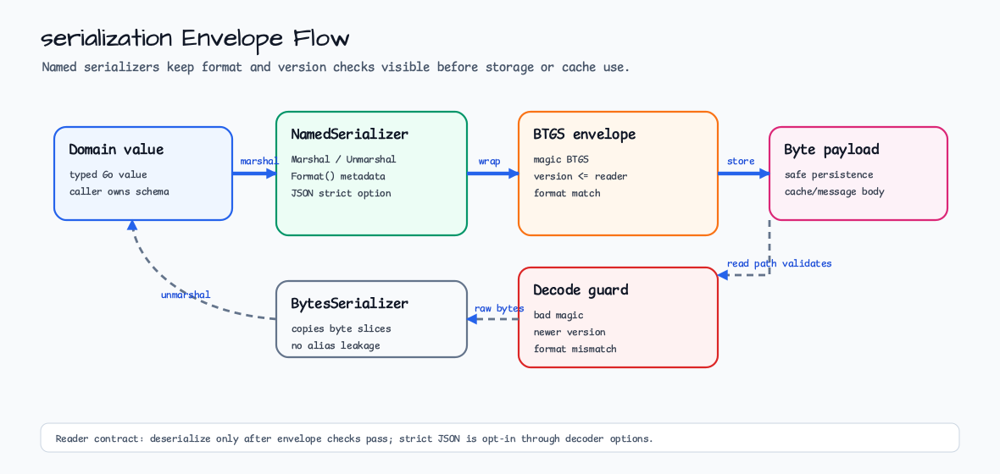

# serialization

[English](README.md) | [한국어](README.ko.md)

`serialization` defines small serializer contracts for values that cross
storage, cache, or message boundaries. It keeps format and version checks
explicit before callers trust decoded values.

## Import

```go
import "github.com/bluetape4k/bluetape-go/serialization"
```

## Usage



```go
type Account struct {
    ID     string `json:"id"`
    Active bool   `json:"active"`
}

jsonSerializer := serialization.NewJSONSerializer[Account]()
versioned, err := serialization.NewVersionedSerializer[Account](jsonSerializer, 1)
if err != nil {
    return err
}

data, err := versioned.Marshal(Account{ID: "acct-1", Active: true})
if err != nil {
    return err
}
value, err := versioned.Unmarshal(data)
```

## Behavior

- `JSONSerializer` uses `encoding/json` and rejects trailing JSON values.
- `WithDisallowUnknownFields` enables strict object decoding.
- `BytesSerializer` copies byte slices on marshal and unmarshal.
- `VersionedSerializer` wraps payloads in a `BTGS` envelope with format and
  version metadata.

## Test

```bash
go test -count=1 ./serialization
```
