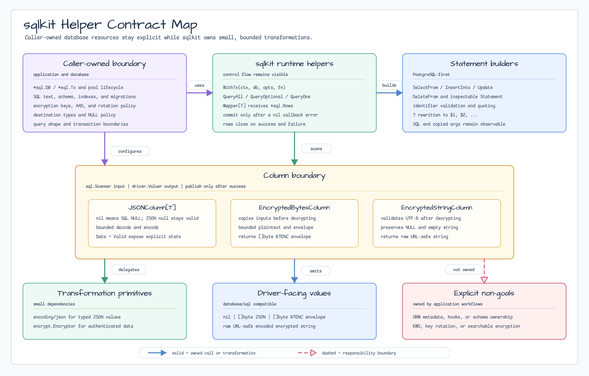
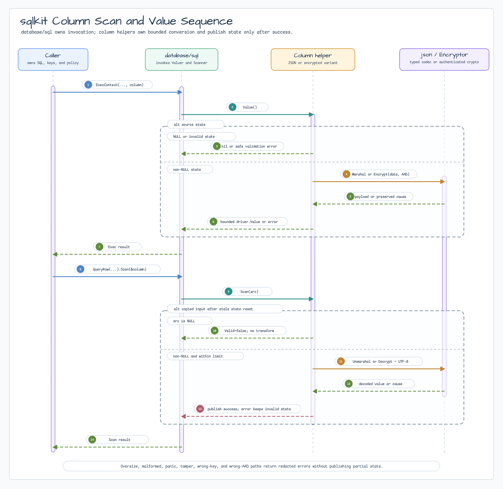
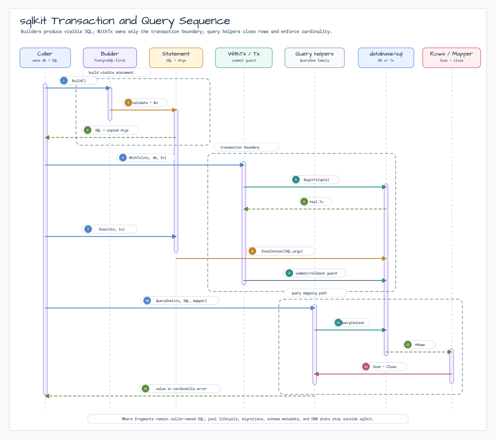

# sqlkit

[English](README.md) | [한국어](README.ko.md)

`sqlkit`은 context-aware transaction, 명시적 row mapping, PostgreSQL 우선
inspectable SQL statement builder를 위한 작은 `database/sql` helper를
제공합니다. SQL 문자열과 args는 caller가 소유하며 숨겨진 SQL을 만들지
않습니다.

## Import

```go
import "github.com/bluetape4k/bluetape-go/sqlkit"
```

## 사용 예

```go
err := sqlkit.WithTx(ctx, db, nil, func(ctx context.Context, tx *sql.Tx) error {
    stmt, err := sqlkit.InsertInto("accounts").
        Columns("id", "name").
        Values(id, name).
        Build()
    if err != nil {
        return err
    }
    _, err = stmt.Exec(ctx, tx)
    return err
})
if err != nil {
    return err
}

stmt, err := sqlkit.SelectFrom("accounts").
    Columns("name").
    Where("id = ?", id).
    Build()
if err != nil {
    return err
}

name, err := sqlkit.QueryOne(ctx, db, stmt.SQL, func(rows *sql.Rows) (string, error) {
    var value string
    if err := rows.Scan(&value); err != nil {
        return "", err
    }
    return value, nil
}, stmt.Args...)
if err != nil {
    return err
}
_ = name

// stmt.SQL은 inspectable합니다:
// select "name" from "accounts" where id = $1
// stmt.Args는 []any{id}입니다.
```

## JSON 및 암호화 컬럼

컬럼 helper는 SQL NULL과 JSON `null` 또는 빈 평문을 구분합니다.

| 저장 값 | Helper | SQL NULL | NULL이 아닌 빈 값 |
|---|---|---|---|
| JSON/JSONB text 또는 bytes | `JSONColumn[T]` | `Valid=false` | JSON literal `null`은 `Valid=true`입니다. |
| BYTEA/BLOB envelope | `EncryptedBytesColumn` | `Valid=false` | `Valid=true`인 빈 평문이나 nil 평문을 암호화합니다. |
| TEXT/VARCHAR base64 envelope | `EncryptedStringColumn` | `Valid=false` | `Valid=true`인 빈 문자열을 암호화합니다. |

`JSONColumn[T]`은 `database/sql`에 바로 전달할 수 있습니다.

```go
type Profile struct {
    Name string `json:"name"`
}

var profile sqlkit.JSONColumn[Profile]
err := db.QueryRowContext(ctx,
    "select profile from accounts where id = $1", id,
).Scan(&profile)

updated := sqlkit.JSONColumn[Profile]{
    Data:  Profile{Name: "Ada"},
    Valid: true,
}
_, err = db.ExecContext(ctx,
    "update accounts set profile = $1 where id = $2", updated, id,
)
```

암호화 컬럼은 caller가 소유하는 `encrypt.Encryptor`를 재사용합니다. Constructor에
전달한 associated data는 내부에서 복사합니다.

```go
payload := sqlkit.NewEncryptedBytesColumn(encryptor,
    []byte("table=secrets:column=payload"))
payload.Data = []byte("secret payload")
payload.Valid = true

stmt, err := sqlkit.InsertInto("secrets").
    Columns("id", "payload").
    Values(id, payload).
    Build()

loaded, err := sqlkit.QueryOne(ctx, db,
    "select payload from secrets where id = $1",
    func(rows *sql.Rows) ([]byte, error) {
        column := sqlkit.NewEncryptedBytesColumn(encryptor,
            []byte("table=secrets:column=payload"))
        if err := rows.Scan(&column); err != nil {
            return nil, err
        }
        return append([]byte(nil), column.Data...), nil
    }, id)
```

Generated query parameter는 sqlc, Jet, ORM runtime dependency 없이 표준
`driver.Valuer` contract를 받을 수 있습니다.

```go
note := sqlkit.NewEncryptedStringColumn(encryptor,
    []byte("table=secrets:column=note"))
note.Data = "secret text"
note.Valid = true

err := queries.UpdateSecret(ctx, UpdateSecretParams{
    ID:   id,
    Note: note, // generated field가 driver.Valuer를 받습니다.
})
```

`DefaultJSONColumnMaxBytes`와
`DefaultEncryptedColumnMaxPlaintextBytes`의 기본값은 1 MiB입니다.
`DefaultEncryptedColumnMaxCiphertextBytes`의 기본값은 2 MiB입니다. Limit이
0이면 기본값을 쓰고, 양수이면 해당 값으로 제한합니다. 음수이면
`ErrInvalidColumnValue`, source나 output이 제한을 넘으면
`ErrColumnValueTooLarge`를 반환합니다.

`Scan`은 driver가 소유한 bytes를 복사하고 decode 전에 이전 값을 지웁니다.
실패하면 column은 invalid 상태로 남습니다. 암호화 constructor도 associated data를
복사합니다. Error는 `errors.Is`로 sqlkit과 `encrypt` sentinel을 확인할 수 있지만,
error string에는 JSON, plaintext, ciphertext, key, associated data를 넣지 않습니다.
암호문은 호출마다 random nonce를 사용하므로 equality, ordering, filtering query에
사용할 수 없습니다.

## Diagram



Contract map은 `sqlkit`이 `database/sql` boundary에 머문다는 점을 보여줍니다.
Caller가 handle과 SQL을 소유하고, helper는 transaction control, row mapping,
inspectable PostgreSQL-first statement, 작은 safety check만 제공합니다.



Column sequence는 `database/sql`이 `driver.Valuer`와 `sql.Scanner`를 호출하는
과정을 보여줍니다. SQL NULL 분기, 제한된 JSON 또는 암호화 작업, 실패한 scan이
부분 상태를 공개하지 않는 규칙도 함께 나타냅니다.



Sequence는 builder output이 `WithTx`, `Statement.Exec`, commit/rollback
handling, `QueryOne`, explicit mapper scanning, row closing, cardinality
error로 이어지는 흐름을 보여줍니다.

## Engine별 GIS helper

Spatial SQL은 PostgreSQL 우선 core builder 밖에 둡니다. Database 계약에 맞는
독립 package를 선택하세요.

| Engine | Package | 계약 |
|---|---|---|
| PostGIS | [`sqlkit/postgis`](postgis/README.ko.md) | EWKB/SRID value, spatial DDL, indexed `ST_DWithin`, bounding-box helper. |
| MySQL 8.4 | [`sqlkit/mysqlgis`](mysqlgis/README.ko.md) | SRID-constrained WKB value, axis-order-aware constructor, spherical distance, MBR helper. |
| MariaDB | [`sqlkit/mariadbgis`](mariadbgis/README.ko.md) | SRID-constrained WKB value, engine-native constructor, distance, MBR helper. |

이 helper들은 shared dialect abstraction을 만들지 않습니다. Engine별 SRID,
axis-order, index, distance 의미를 호출자가 확인할 수 있게 유지합니다.

## 선택 가이드

[SQL generator/migration guide](../docs/sql-generator-migration-guidance.ko.md)는
direct `database/sql`, `sqlkit`, sqlc, Jet, ent, Bun, GORM, goqu, Atlas를 언제
선택할지 정리합니다.

| 필요 | 사용 | 비고 |
|---|---|---|
| 하나의 transaction 실행 | `WithTx` | caller가 `*sql.DB` lifecycle을 소유하고 `sqlkit`은 시작한 transaction만 소유합니다. |
| `*sql.DB`와 `*sql.Tx`를 같은 코드에서 사용 | `Session`, `Queryer`, `Execer` | `database/sql` method와 맞춘 작은 interface입니다. |
| 여러 row mapping | `QueryAll` | mapper가 `*sql.Rows`를 받아 `Scan`을 호출합니다. |
| 0 또는 1개 row mapping | `QueryOptional` | row가 없으면 `(value, false, nil)`을 반환합니다. |
| 정확히 1개 row 요구 | `QueryOne` | cardinality 실패 시 `ErrNoRows` 또는 `ErrTooManyRows`를 반환합니다. |
| 단일 column scan | `ScanOne` | destination pointer를 위한 convenience mapper입니다. |
| 간단한 SQL 생성 | `SelectFrom`, `InsertInto`, `Update`, `DeleteFrom` | 명시적인 PostgreSQL-style SQL과 복사된 args를 생성합니다. |
| 생성된 mutation 실행 | `Statement.Exec` | `ExecContext`를 감싼 context-aware wrapper입니다. |

## Workshop Adoption

Runnable workshop example은 이 package README가 아니라
[`bluetape-go-workshop`](https://github.com/bluetape4k/bluetape-go-workshop)에
둡니다.
[`sql-access-strategy-decision`](https://github.com/bluetape4k/bluetape-go-workshop/tree/develop/examples/sql-access-strategy-decision),
[`sql-order-repository`](https://github.com/bluetape4k/bluetape-go-workshop/tree/develop/examples/sql-order-repository),
[`sql-transaction-boundary`](https://github.com/bluetape4k/bluetape-go-workshop/tree/develop/examples/sql-transaction-boundary),
[`gin-sql-crud-api`](https://github.com/bluetape4k/bluetape-go-workshop/tree/develop/examples/gin-sql-crud-api),
[`gin-sql-order-service`](https://github.com/bluetape4k/bluetape-go-workshop/tree/develop/examples/gin-sql-order-service)를
참조하세요.

## 동작

- Builder output은 PostgreSQL 우선이며 `$1`, `$2`, ... placeholder를
  사용합니다. 첫 builder slice에는 broad dialect abstraction이 없습니다.
- Builder는 table/column identifier를 검증하고 double quote 처리합니다.
  `Where` fragment는 caller-owned SQL이며, 그 안의 `?` value placeholder만
  PostgreSQL placeholder로 변환합니다.
- `Update`와 `DeleteFrom`은 accidental full-table mutation을 피하기 위해
  기본적으로 `Where` clause를 요구합니다.
- `sqlkit`은 pool lifecycle, migration, schema metadata, generated code,
  model hook, cache invalidation, ORM state를 관리하지 않습니다.
- `WithTx`는 callback이 nil을 반환할 때만 commit합니다. callback error는
  rollback을 유발하며 원래 error를 `errors.Is` / `errors.As`로 확인할 수
  있게 보존합니다.
- `QueryAll`, `QueryOptional`, `QueryOne`은 success/failure path 모두에서
  `*sql.Rows`를 닫습니다.
- Query helper는 driver error와 context error를 `%w`로 보존합니다.
- driver-native API, generated type-safe query code, entity modeling,
  migration orchestration, non-PostgreSQL placeholder generation, first-class
  join builder node, 큰 query builder/ORM surface가 필요하면 direct
  `database/sql`, `pgx`, sqlc, Jet, ent, Bun, GORM, goqu를 사용하세요.
- sqlc, Jet, Atlas는 application workflow boundary에 둡니다. `sqlkit`은 이
  도구들에 대한 runtime dependency를 의도적으로 추가하지 않습니다.

## Test

```bash
go test -count=1 ./sqlkit
go test -race -count=1 ./sqlkit
```
