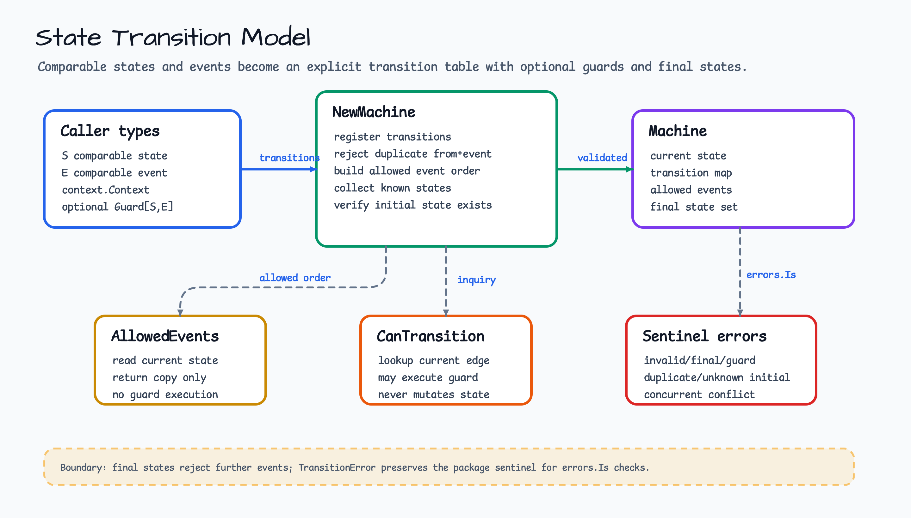
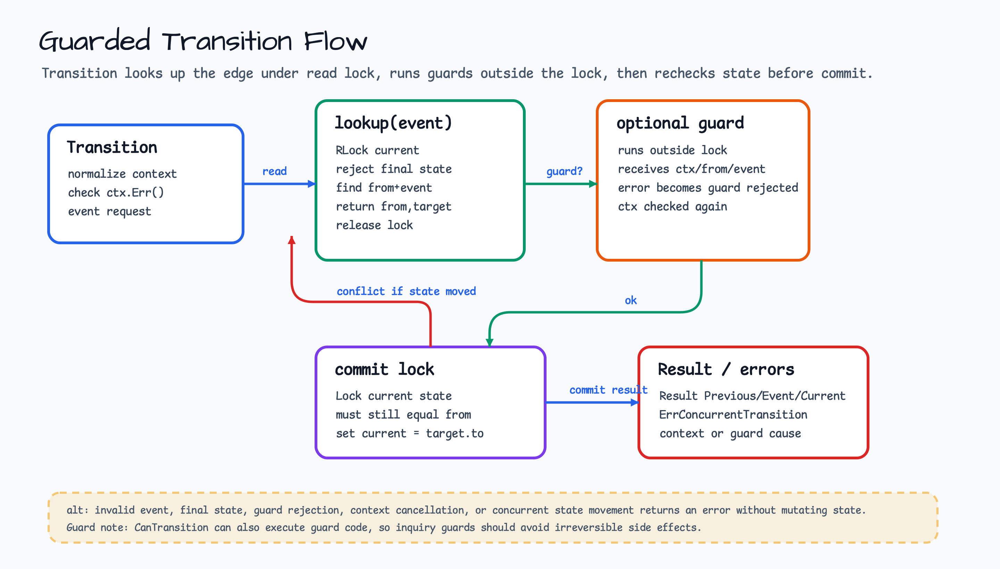

# state

[English](README.md) | [한국어](README.ko.md)

`state`는 ordinary Go code를 위한 작은 finite state machine primitive를 제공합니다. API는 framework-free로 유지됩니다. Caller는 comparable state/event value, explicit transition, optional guard, final state를 정의합니다.

## 다이어그램





## 예제

```go
machine, err := state.NewMachine(
    "created",
    []state.Transition[string, string]{
        {From: "created", Event: "pay", To: "paid"},
    },
)
if err != nil {
    return err
}

result, err := machine.Transition(context.Background(), "pay")
```

## 실행 가능한 예제

Compile-checked 예제는 [`state_example_test.go`](state_example_test.go)에 있습니다.
다음 명령으로 실행합니다.

```bash
go test ./state
```

## 계약

- `Transition`은 하나의 event를 적용하거나 state를 변경하지 않고 error를 반환합니다.
- Guard는 caller `context.Context`를 받고 error를 반환해 transition을 거부할 수 있습니다.
- Guard는 internal lock 밖에서 실행됩니다. Machine은 commit 전에 state를 다시 확인하므로 concurrent caller는 deterministic conflict error를 받습니다.
- `CanTransition`은 machine을 변경하지 않고 guard code를 평가할 수 있습니다. Inquiry call에 사용되는 guard는 irreversible side effect를 피해야 합니다.
- `AllowedEvents`는 current state에 등록된 event를 registration order로 반환합니다. Guard를 평가하지 않으며 `Transition` 성공을 보장하지 않습니다.
- `ErrInvalidTransition`, `ErrGuardRejected`, `ErrFinalState`, `ErrConcurrentTransition`, `ErrDuplicateTransition`, `ErrUnknownInitialState`를 포함한 sentinel error는 `errors.Is`와 함께 동작합니다.
