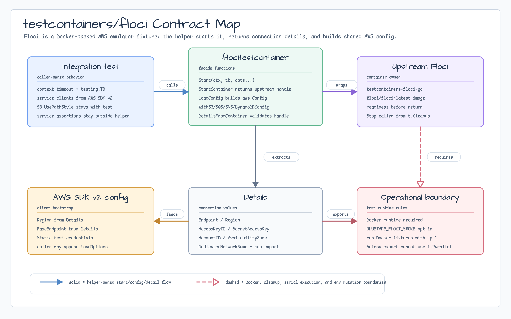
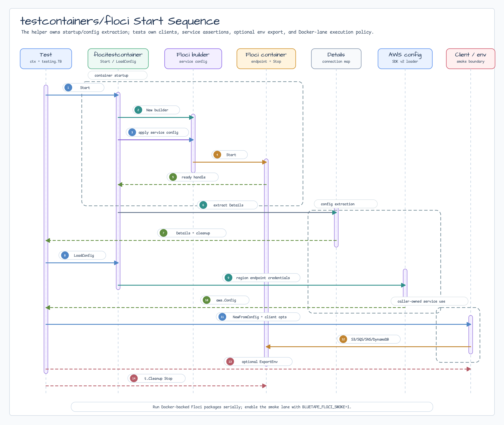

# testcontainers/floci

[English](README.md) | [한국어](README.ko.md)

`testcontainers/floci` starts a Floci container for local AWS integration tests
and returns endpoint, region, test credentials, account, and availability-zone
details for AWS SDK for Go v2 clients.

## Import

```go
import flocitestcontainer "github.com/bluetape4k/bluetape-go/testcontainers/floci"
```

## Usage

```go
ctx, cancel := context.WithTimeout(context.Background(), 90*time.Second)
t.Cleanup(cancel)

details := flocitestcontainer.Start(ctx, t)
cfg := flocitestcontainer.LoadConfig(ctx, t, details)

client := s3.NewFromConfig(cfg, func(options *s3.Options) {
    options.UsePathStyle = true
})
```

S3 clients need `UsePathStyle` for local endpoints. Keep service-specific AWS
client behavior in the test or package that owns the service; this helper only
starts Floci and builds the shared AWS config.

## Diagram



The contract map shows the package boundary: integration tests own AWS SDK
clients and assertions, `flocitestcontainer` owns Floci startup and detail
extraction, and Docker/runtime policy stays outside the helper.



The sequence follows `Start` through upstream builder setup, readiness, `Details`
extraction, `LoadConfig`, caller-owned service smoke calls, optional env export,
and bounded cleanup.

## Service Configuration

Floci enables broad AWS service coverage by default. This package exposes the
upstream service config types for the first roadmap services so tests can tune
them without importing the upstream Testcontainers module directly.

```go
details := flocitestcontainer.Start(ctx, t,
    flocitestcontainer.WithS3Config(flocitestcontainer.DefaultS3Config()),
    flocitestcontainer.WithSQSConfig(flocitestcontainer.DefaultSQSConfig()),
    flocitestcontainer.WithSNSConfig(flocitestcontainer.DefaultSNSConfig()),
    flocitestcontainer.WithDynamoDBConfig(flocitestcontainer.DefaultDynamoDBConfig()),
)
```

Supported first-slice config aliases:

- `S3Config`
- `SQSConfig`
- `SNSConfig`
- `DynamoDBConfig`

These are Floci emulator settings, not bluetape service wrappers. Use AWS SDK
for Go v2 clients directly for service operations.

## Connection Details

`Details.ConnectionDetails()` returns the shared map used by
`testcontainers/server` env export helpers.

```go
details := flocitestcontainer.Start(ctx, t)
if err := tcserver.ExportEnv(t, details.ConnectionDetails(), map[string]string{
    flocitestcontainer.EndpointKey:        "BLUETAPE_FLOCI_ENDPOINT",
    flocitestcontainer.RegionKey:          "BLUETAPE_FLOCI_REGION",
    flocitestcontainer.AccessKeyIDKey:     "BLUETAPE_FLOCI_ACCESS_KEY_ID",
    flocitestcontainer.SecretAccessKeyKey: "BLUETAPE_FLOCI_SECRET_ACCESS_KEY",
}); err != nil {
    t.Fatal(err)
}
```

`tcserver.ExportEnv` uses `testing.TB.Setenv`; do not call it from tests that
use `t.Parallel` or have parallel ancestors.

## Behavior

- Uses upstream `github.com/floci-io/testcontainers-floci-go`.
- Uses the upstream default image `floci/floci:latest`.
- Waits for Floci readiness before returning.
- Registers bounded `Stop` cleanup with `t.Cleanup`.
- Exposes:
  - `floci.endpoint`
  - `floci.region`
  - `floci.access_key_id`
  - `floci.secret_access_key`
  - `floci.account_id`
  - `floci.availability_zone`
  - `floci.dedicated_network_name`
- The access key and secret key are Floci test credentials only.

## Scope

This is the #220 first slice and the base fixture for #61. It includes one
opt-in smoke test for S3, SQS, SNS fanout through SQS, and DynamoDB so normal
`go test ./...` remains stable while local and CI Docker lanes can still prove
the emulator contract explicitly.

- S3 example expansion stays in #62.
- SQS/SNS producer-consumer examples stay in #63.
- DynamoDB repository and conditional-write decisions stay in #64.
- Graph database fixtures stay behind #50/#44.
- Infrastructure/security/observability fixtures need a concrete consumer issue
  before implementation.

## Operational Boundaries

- Docker or another Testcontainers-compatible runtime must be available.
- Floci may pull `floci/floci:latest` on first use.
- Dynamic host port mapping is the default. Read `Details.Endpoint` after the
  container starts.
- Run Docker-backed Testcontainers packages serially when resources or ports are
  shared.
- CI jobs without Docker should skip `./testcontainers/...`; CI jobs that cover
  these helpers should run the packages with `-p 1`.
- The upstream Floci module enables broad services by default. Run this package
  serially and rerun adjacent Docker fixtures when changing Floci service
  selection.

## Test

```bash
go test -p 1 -count=1 ./testcontainers/floci
BLUETAPE_FLOCI_SMOKE=1 go test -p 1 -count=1 ./testcontainers/floci
```
