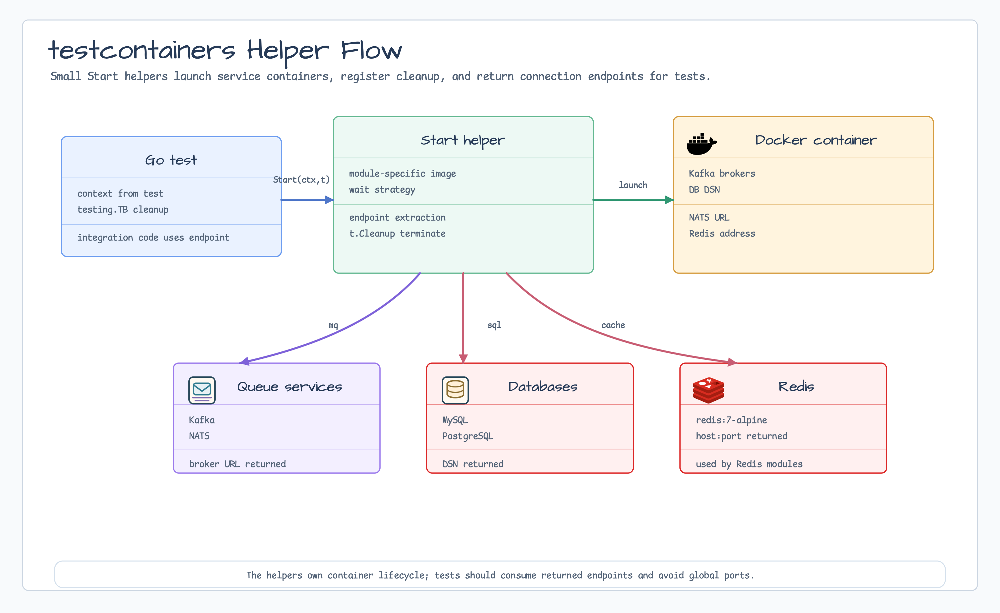

# testcontainers/nats

[English](README.md) | [한국어](README.ko.md)

`testcontainers/nats`는 integration test용 NATS container를 시작하고 client
connection URL을 반환합니다.



## 가져오기

```go
import natstestcontainer "github.com/bluetape4k/bluetape-go/testcontainers/nats"
```

## 사용 예

```go
url := natstestcontainer.Start(context.Background(), t)
client, err := nats.Connect(url, nats.Timeout(5*time.Second))
if err != nil {
    t.Fatalf("connect nats: %v", err)
}
t.Cleanup(client.Close)
```

## 동작

- `nats:2.10-alpine`을 사용합니다.
- Module-provided connection string을 반환합니다.
- Container termination을 `t.Cleanup`에 등록합니다.
- Fatal test failure는 supplied `testing.T`로 보고됩니다.

## 운영 경계

- Docker 또는 다른 Testcontainers-compatible runtime이 필요합니다.
- Fixture는 test용이며 production NATS configuration을 노출하지 않습니다.

## 테스트

```bash
go test -count=1 ./testcontainers/nats
```
