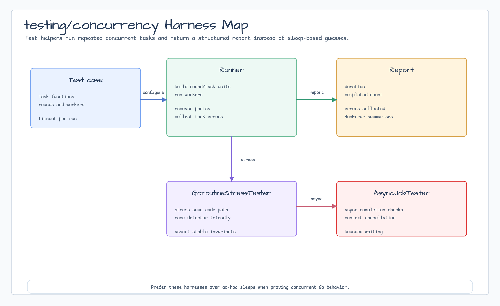

# testing

[English](README.md) | [한국어](README.ko.md)

`testing` provides small asynchronous assertion helpers for bluetape-go tests.
Use it when a condition should become true eventually, remain true for a short
observation window, or prove a context cancellation contract.



## Import

```go
import bttesting "github.com/bluetape4k/bluetape-go/testing"
```

## Usage

```go
var ready atomic.Bool
go func() {
    time.Sleep(10 * time.Millisecond)
    ready.Store(true)
}()

bttesting.Eventually(t, time.Second, ready.Load)
bttesting.Consistently(t, 100*time.Millisecond, ready.Load)

bttesting.RequireAwaitValue(context.Background(), t, time.Second, 10*time.Millisecond, func(ctx context.Context) (string, error) {
    return cache.Get(ctx, "customer:42")
}, "fresh")

bttesting.RequireAwait(context.Background(), t, time.Second, 10*time.Millisecond, func(ctx context.Context) (bool, error) {
    return lock.TryAcquire(ctx, "invoice:42")
}, func(acquired bool, err error) bttesting.AwaitStatus {
    if err != nil {
        return bttesting.AwaitFailure
    }
    if acquired {
        return bttesting.AwaitSuccess
    }
    return bttesting.AwaitContinue
})

bttesting.RequireContextCanceled(t, func(ctx context.Context) error {
    return ctx.Err()
})

bttesting.RequireCleanupOnCancel(t, 50*time.Millisecond, func(ctx context.Context, ready func(), cleaned func()) error {
    ready()
    <-ctx.Done()
    cleaned()
    return ctx.Err()
})
```

## Behavior

- Helpers fail the supplied `*testing.T` when the condition does not satisfy the
  expected timing contract.
- `EventuallyWithPolling` and `ConsistentlyWithPolling` allow explicit polling
  intervals.
- `CheckAwait` and `RequireAwait` poll a context-aware probe until a supplied
  check returns `AwaitSuccess` or `AwaitFailure`. Diagnostics include the final
  observed value/error and attempt count.
- `CheckAwaitValue`/`RequireAwaitValue` wait for an eventually expected value;
  `CheckAwaitError`/`RequireAwaitError` wait for an expected non-context error
  state.
- `CheckContextCanceled` and `CheckDeadlineExceeded` return diagnostics when an
  operation masks `context.Canceled` or `context.DeadlineExceeded`.
- `CheckWaiterReleased` and `CheckCleanupOnCancel` prove cooperative waiter
  release and cleanup after cancellation. The matching `Require*` helpers fail
  the supplied `testing.TB`.
- Await and cancellation helpers are cooperative: the operation under test must
  observe `ctx.Done()` or return. Go cannot safely stop a goroutine that ignores
  its context forever. Helpers do not retry caller-owned `context.Canceled` or
  `context.DeadlineExceeded`.
- Use await helpers for eventual cache invalidation, lock acquisition,
  Testcontainers readiness, workflow status, HTTP mock verification, and similar
  bounded test observations.
- Use `testing/concurrency` when the test also needs repeated bounded
  goroutine execution, panic aggregation, or stress reporting.
- The package is intended for tests only; production retry or timeout behavior
  belongs in `resilience`.

## Test

```bash
go test -count=1 ./testing
go test -race -count=1 ./testing
```
