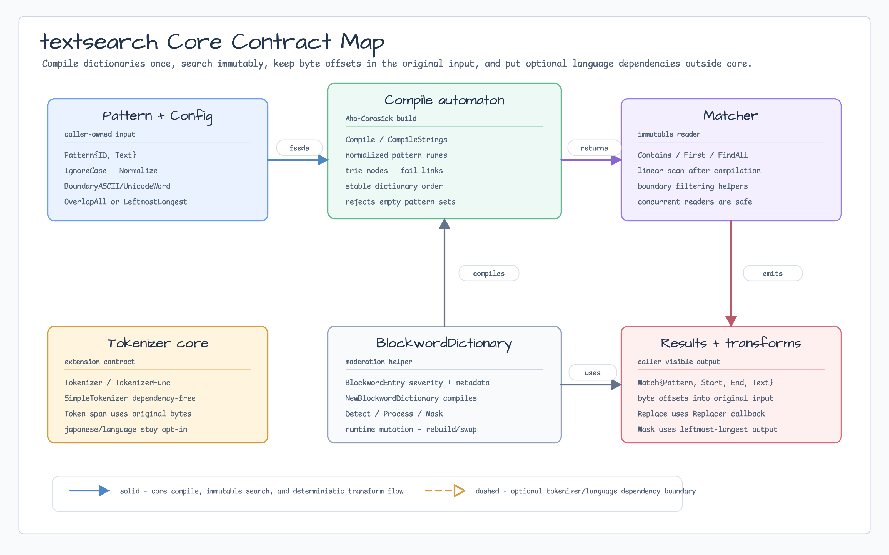
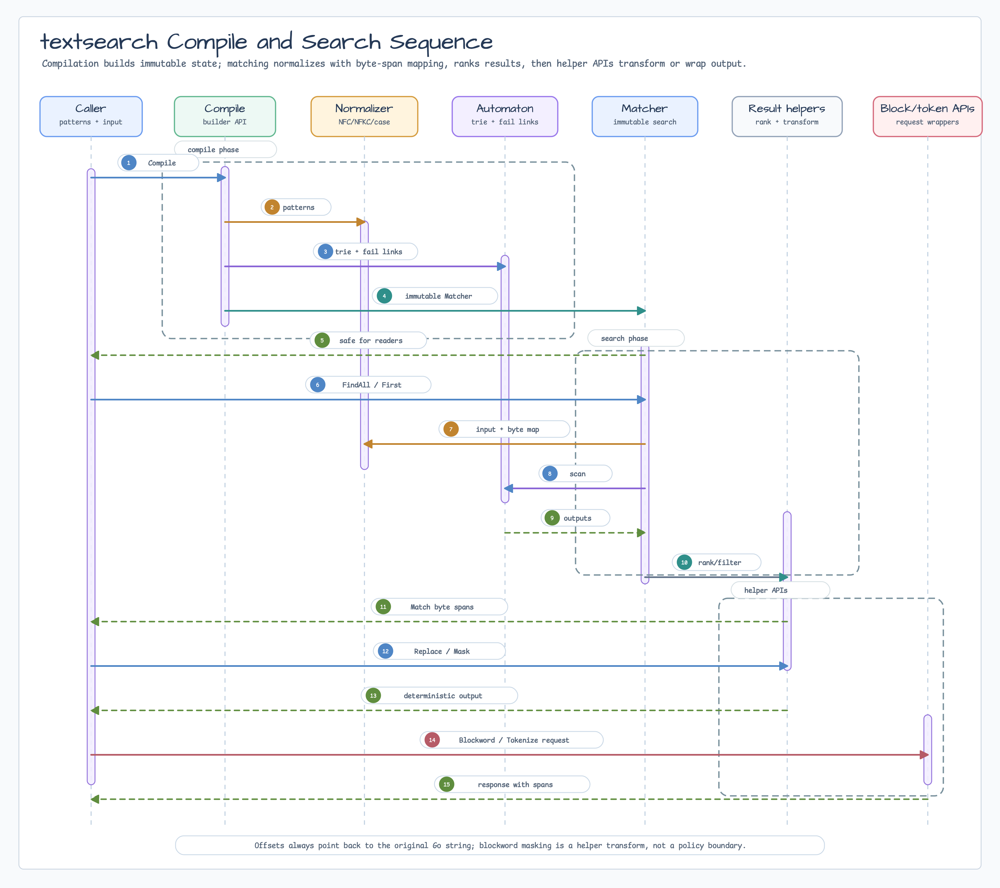

# textsearch

[English](README.md) | [한국어](README.ko.md)

`textsearch` provides deterministic multi-pattern search, tokenizer core
interfaces, and blockword masking for Go callers. It compiles dictionaries into
immutable Aho-Corasick matchers and exposes contains, first-match, all-match,
replacement, masking, tokenization, dictionary, and blockword response helpers.

## Import

```go
import "github.com/bluetape4k/bluetape-go/textsearch"
```

## Usage

```go
matcher, err := textsearch.Compile([]textsearch.Pattern{
    {ID: "greeting", Text: "hello"},
    {ID: "subject", Text: "world"},
}, textsearch.Config{IgnoreCase: true})
if err != nil {
    return err
}

matches := matcher.FindAll("Hello, world!")
_ = matches[0].Start // byte offset in the original input
```

For deterministic replacement:

```go
masked := matcher.Mask("Hello, world!", '*')
_ = masked
```

For dependency-free lexical tokenization:

```go
tokenizer := textsearch.NewSimpleTokenizer()
request, err := textsearch.NewTokenizeRequest("Hello 세계 123!", textsearch.TokenizeOptions{
    Normalize: textsearch.NormalizeNFC,
})
if err != nil {
    return err
}

response, err := tokenizer.Tokenize(request)
if err != nil {
    return err
}
_ = response.Tokens[0].Span.Start // byte offset in the original input
```

For moderation-like blockword processing, compile a static dictionary and
rebuild a new dictionary when entries change:

```go
dictionary, err := textsearch.NewBlockwordDictionary([]textsearch.BlockwordEntry{
    {ID: "ko", Text: "욕설", Severity: textsearch.SeverityHigh},
    {ID: "ja", Text: "ホモ", Severity: textsearch.SeverityMiddle},
}, textsearch.Config{Normalize: textsearch.NormalizeNFC})
if err != nil {
    return err
}

request, err := textsearch.NewBlockwordRequest("욕설 그리고 ホモ", textsearch.BlockwordOptions{
    Mask:        "*",
    MinSeverity: textsearch.SeverityMiddle,
})
if err != nil {
    return err
}

response, err := dictionary.Process(request)
if err != nil {
    return err
}
_ = response.MaskedText // "** 그리고 **"
```

## Diagram



The contract map separates the immutable Aho-Corasick matcher, deterministic
match transforms, tokenizer extension point, and blockword dictionary rebuild
boundary. Optional language-specific packages stay outside the core package.



The sequence follows dictionary compilation, normalization with original byte
offset mapping, automaton scanning, deterministic ranking, replacement/masking,
and blockword/tokenizer response helpers.

## Behavior

- `Matcher` is immutable after `Compile` returns and is safe for concurrent
  readers.
- `FindAll` returns matches sorted by original byte offset. The default
  `OverlapAll` mode returns overlapping and duplicate-pattern matches.
- `OverlapLeftmostLongest` returns deterministic non-overlapping matches by
  selecting the longest match at each leftmost start.
- `First` returns the earliest accepted match; ties prefer longer patterns,
  then dictionary order.
- Duplicate pattern text is allowed. Use `Pattern.ID` to preserve caller-owned
  dictionary metadata.
- `NormalizeNFC` and `NormalizeNFKC` normalize patterns and input before
  matching. Match `Start` and `End` still refer to byte offsets in the original
  input.
- `Token` spans also use byte offsets in the original input. `Token.Normalized`
  may have a different length from `Token.Text`.
- `Tokenizer` and `TokenizerFunc` are the core extension points. Optional
  language-specific dependencies stay outside the core package; import
  [`textsearch/japanese`](japanese/README.md) when callers explicitly need the
  Kagome-backed Japanese tokenizer, or [`textsearch/language`](language/README.md)
  when callers explicitly need Lingua-Go language detection.
- `SimpleTokenizer` is deterministic and dependency-free. It groups Unicode
  letters/marks, digits, whitespace, punctuation, and symbols for tests and
  simple lexical workflows; it is not a language-aware POS tagger.
- `DictionaryProvider`, `StaticDictionaryProvider`, and `DictionarySet` model
  dictionary loading and immutable lookup without prescribing storage,
  tokenizer model size, or runtime reload policy.
- `IgnoreCase` uses Go's `strings.ToLower`; locale-specific casing is outside
  this package's scope.
- `BoundaryASCIIWord` and `BoundaryUnicodeWord` filter matches to word
  boundaries. Boundary checks are helper behavior, not a moderation or security
  boundary.
- Search complexity is linear in normalized input runes plus emitted matches
  after compilation. Compilation is linear in dictionary size plus fail-link
  construction.
- Replacement and masking use leftmost-longest non-overlapping matches even
  when the matcher is configured to report all overlaps.
- `BlockwordDictionary` is immutable after `NewBlockwordDictionary` returns and
  is safe for concurrent readers. Runtime dictionary mutation is intentionally
  represented as a rebuild/swap workflow.
- `BlockwordEntry` carries severity and caller-owned metadata. `BlockwordOptions`
  can filter by minimum severity before deterministic non-overlapping masking.
- `NewBlockwordRequest` rejects blank input and inputs above
  `MaxBlockwordTextLength` runes. Error messages report lengths, not raw input.
- `NewTokenizeRequest` rejects blank input and inputs above
  `MaxTokenizeTextLength` runes. Error messages report lengths, not raw input.
- Blockword masking is a helper transform for service code. It is not a
  complete moderation policy, authorization check, or security boundary.

## Test

```bash
go test -count=1 ./textsearch
go test -race -count=1 ./textsearch
go test -count=1 ./textsearch/japanese
go test -race -count=1 ./textsearch/japanese
go test -count=1 ./textsearch/language
go test -race -count=1 ./textsearch/language
```
