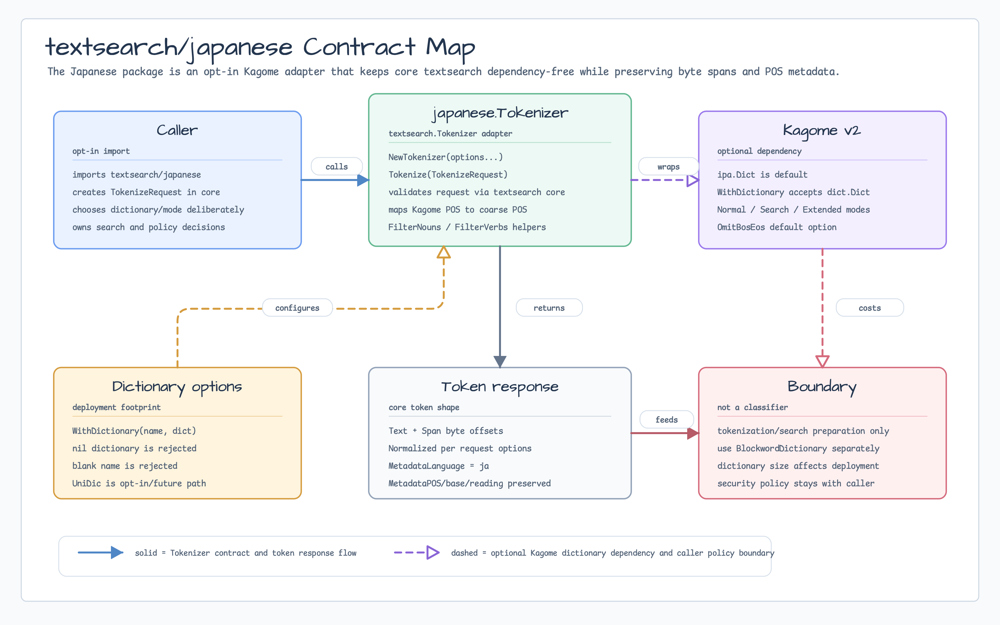
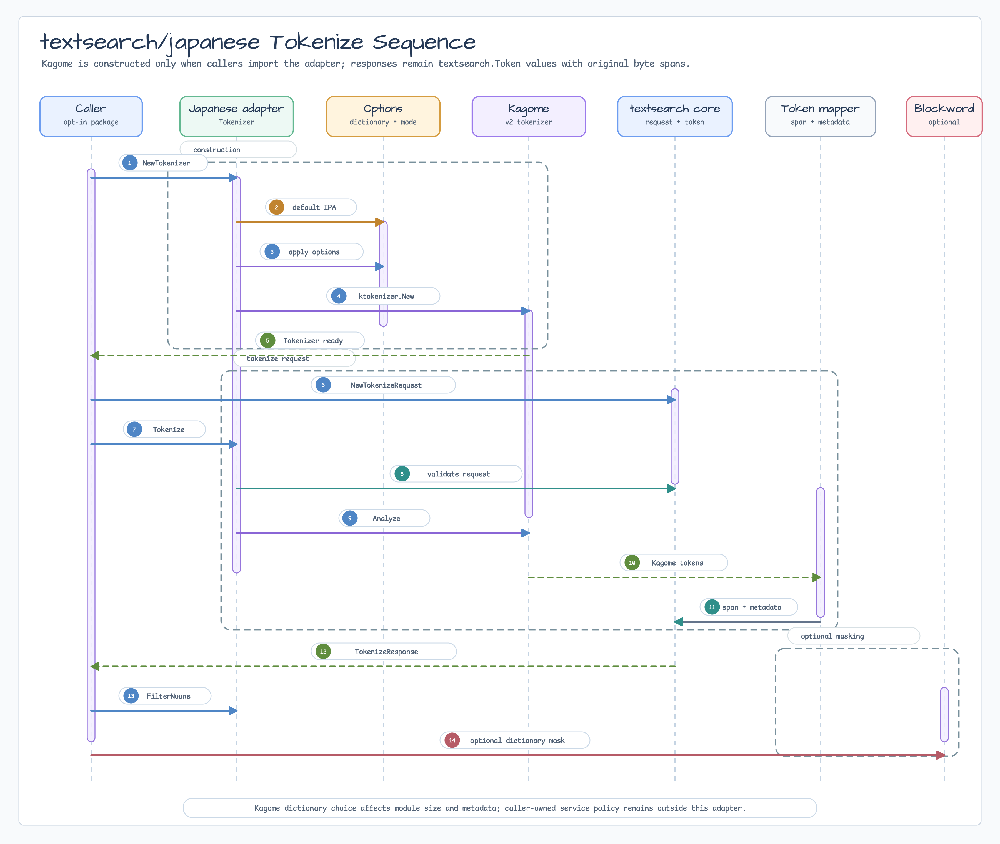

# 일본어 Tokenizer

`textsearch/japanese`는 `textsearch.Tokenizer` 계약을 Kagome v2로 구현하는
선택형 패키지입니다. 이 패키지를 import하는 호출자만 Kagome와 사전 의존성을
가져가며, core `textsearch` 패키지는 dependency-free 상태를 유지합니다.

## 설치

```bash
go get github.com/bluetape4k/bluetape-go/textsearch/japanese
```

현재 기본값은 Kagome IPA 사전입니다.

```go
tokenizer, err := japanese.NewTokenizer()
```

다른 Kagome 사전을 명시적으로 선택해야 한다면 `WithDictionary`를 사용하세요.
UniDic은 배포 크기와 metadata 차이가 크므로 현재는 opt-in/future 범위로
문서화합니다.

## 사용

```go
request, err := textsearch.NewTokenizeRequest("日本語を勉強します。", textsearch.TokenizeOptions{})
if err != nil {
    return err
}
response, err := tokenizer.Tokenize(request)
if err != nil {
    return err
}
for _, token := range japanese.FilterNouns(response.Tokens) {
    fmt.Println(token.Text, token.Metadata[japanese.MetadataPOS])
}
```

반환되는 span은 원본 요청 문자열의 byte offset입니다. 따라서 Go 문자열을
`token.Span.Start:token.Span.End`로 안전하게 slice할 수 있습니다.

## Diagram



Contract map은 `textsearch/japanese`를 core `textsearch.Tokenizer` contract의
opt-in Kagome adapter로 보여줍니다. Dictionary 선택, 배포 footprint, metadata
해석, policy decision은 caller가 소유합니다.



Sequence는 `NewTokenizer`, IPA/default option setup, Kagome analysis, core
request validation, span/metadata mapping, noun filtering, optional
`BlockwordDictionary` 조합 흐름을 보여줍니다.

## 경계

- 이 패키지는 tokenization과 검색 준비용이며 보안 classifier가 아닙니다.
- 사전 선택은 모듈 크기, 배포 비용, token metadata에 영향을 줍니다. 첫 구현은
  IPA를 기본값으로 둡니다.
- Kagome POS 정보는 token metadata에 보존하고, `textsearch.PartOfSpeech`는
  언어 공통 coarse class로 유지합니다.
- masking/detection은 token surface를 선택한 뒤 기존
  `textsearch.BlockwordDictionary`를 조합하세요.

## 검증

패키지는 일본어 tokenization, byte span, normalization, dictionary option,
example, `GoroutineStressTester` coverage를 포함합니다. 실행 명령:

```bash
go test -count=1 ./textsearch/japanese
go test -race -count=1 ./textsearch/japanese
```
