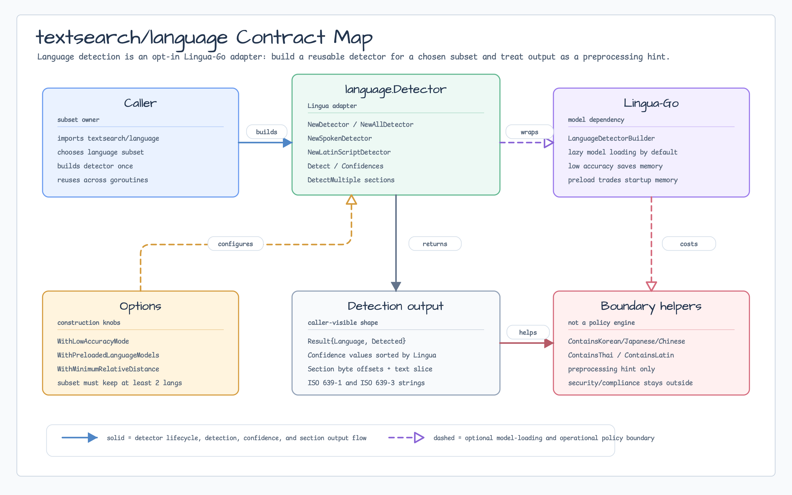
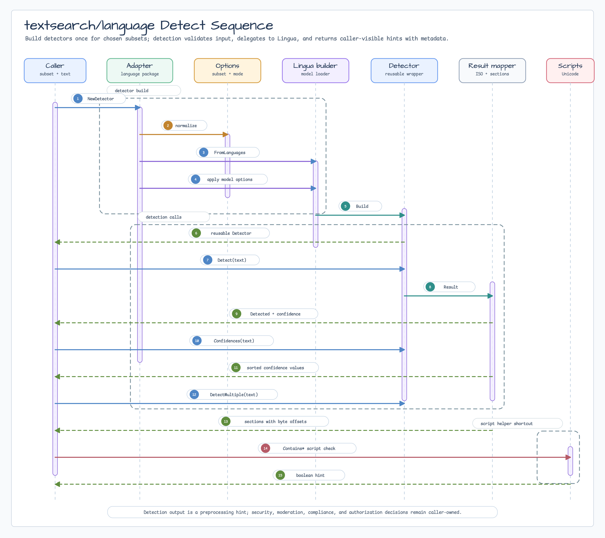

# Language Detection

`textsearch/language` is an optional Lingua-Go adapter for language detection.
It stays outside the core `textsearch` package because Lingua model size,
loading mode, and memory behavior are operational choices.

## Install

```bash
go get github.com/bluetape4k/bluetape-go/textsearch/language
```

## Detector Lifecycle

Build detectors once and reuse them:

```go
detector, err := language.NewDetector([]language.Language{
    language.English,
    language.German,
    language.Japanese,
}, language.WithLowAccuracyMode())
if err != nil {
    return err
}

result, err := detector.Detect("This text is written in English.")
```

Use `NewAllDetector` for every Lingua language, `NewSpokenDetector` for spoken
languages, `NewLatinScriptDetector` for Latin-script languages, or
`NewDetector` for a caller-selected subset. Smaller subsets usually improve
speed, memory behavior, and ambiguous short-text results.

By default Lingua lazy-loads language models. Use `WithPreloadedLanguageModels`
when predictable first-request latency is more important than startup memory.
Use `WithLowAccuracyMode` when memory matters more than short-text accuracy.

## Helpers

- `Detect` returns a boolean `Detected` flag instead of treating unknown text as
  an operational error.
- `Confidences` returns Lingua confidence values in descending order.
- `DetectMultiple` exposes Lingua's mixed-language sections using byte offsets.
- `ContainsKorean`, `ContainsJapanese`, `ContainsChinese`, `ContainsThai`, and
  `ContainsLatin` are small Unicode script helpers.

## Diagram



The contract map shows `textsearch/language` as an optional Lingua-Go adapter.
Callers choose the language subset and model-loading tradeoffs, then reuse a
detector that returns caller-visible results, confidences, sections, and script
hints.



The sequence follows detector construction, option application, Lingua builder
setup, `Detect`, `Confidences`, `DetectMultiple`, byte-offset section mapping,
and Unicode script helper checks.

## Boundaries

- Language detection is a preprocessing hint, not a security, moderation,
  compliance, or authorization boundary.
- Whatlanggo remains documented as a lightweight fallback/comparison path from
  the research note; this package implements the Lingua-Go parity path.
- Build one detector per language subset and reuse it across goroutines.

## Verification

```bash
go test -count=1 ./textsearch/language
go test -race -count=1 ./textsearch/language
```
