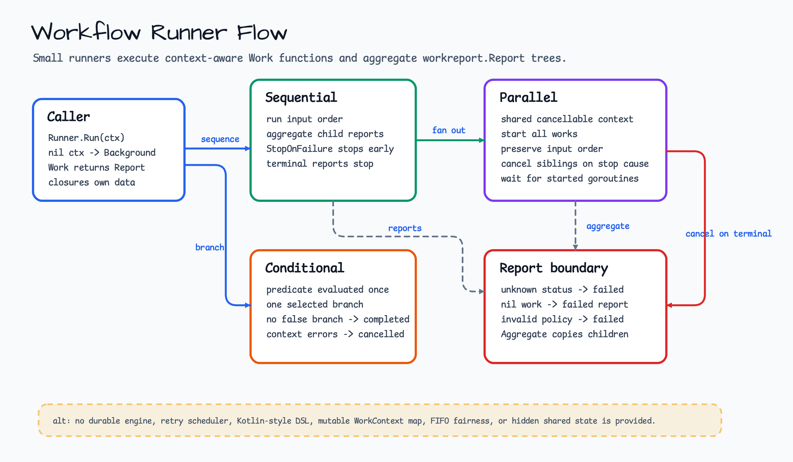

# workflow

[English](README.md) | [한국어](README.ko.md)

`workflow`는 일반 Go work function을 위한 lightweight runner를 제공합니다. 각
work item은 `context.Context`를 받고 `workreport.Report`를 반환합니다.

이 package는 의도적으로 작게 유지됩니다. Sequential, conditional,
all-branches parallel runner만 제공하며 durable workflow engine, retry scheduler,
Kotlin-style DSL, mutable shared `WorkContext` map은 제공하지 않습니다.

## 다이어그램



## 예제

아래 snippet은 `context`, `log/slog` 같은 standard import를 가정합니다.
Compile-checked 버전은 [`workflow_example_test.go`](workflow_example_test.go)에
있습니다.

```go
runner := workflow.Sequential(
    "import",
    workreport.ContinueOnFailure,
    func(context.Context) workreport.Report { return workreport.Completed("read") },
    func(context.Context) workreport.Report { return workreport.Failed("write", err) },
)

report := runner.Run(ctx)
if report.IsPartial() {
    slog.InfoContext(ctx, "workflow produced partial report",
        slog.String("report", report.Name),
        slog.Int("children", len(report.Children)),
    )
}
```

## 실행 가능한 예제

Sequential, conditional, parallel runner의 compile-checked 예제는
[`workflow_example_test.go`](workflow_example_test.go)에 있습니다. 다음 명령으로
실행합니다.

```bash
go test ./workflow
```

## Runners

- `Sequential`은 work를 input order대로 실행합니다. `StopOnFailure`는 첫 failed
  또는 partial child에서 멈추고, `ContinueOnFailure`는 ordinary failure 이후에도
  계속 실행합니다. Aborted/cancelled child report는 항상 sequence를 중단합니다.
- `Conditional`은 predicate를 한 번 평가하고 선택된 branch 하나만 실행합니다.
  False predicate에 false branch가 없으면 completed report를 반환합니다.
- `Parallel`은 모든 work item을 shared cancellable context로 시작하고 child
  report를 input order로 보존합니다. `StopOnFailure`, aborted, cancelled child
  report는 sibling을 cancel하고 시작된 goroutine을 기다립니다.

## 외부 실행 bridge

[`workflow/stepfunctions`](stepfunctions/README.ko.md)는 이 in-process runner와
분리된 package입니다. Caller-owned AWS Step Functions execution을 start,
describe, optional stop, bounded wait/polling하는 bridge만 제공합니다. State
machine을 정의·배포하거나 retry 및 durable workflow engine을 소유하지 않습니다.
Payload 한도, 멱등성, cancellation, fake-first 검증 계약은 package README를
참고하세요.

## 계약

- Nil caller context는 `context.Background()`로 처리합니다.
- Nil work, nil predicate, too many false branches, unknown report status,
  unknown failure policy는 checkable error를 담은 failed report를 반환합니다.
- Predicate cancellation과 caller cancellation은 caller context error를 담은
  cancelled report를 반환합니다.
- Shared data는 ordinary closure와 explicit input으로 다룹니다. 이 package는
  mutable workflow context를 소유하지 않습니다.
