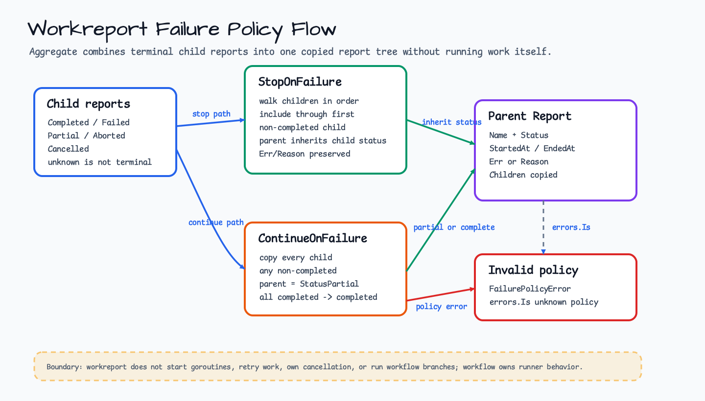

# workreport

[English](README.md) | [한국어](README.ko.md)

`workreport` provides status, failure-policy, and report-tree values for
lightweight workflow code. It is independent from runner execution so ordinary
Go functions and future `workflow` runners can share the same result model.

## Diagram



## Example

The snippet assumes standard imports such as `errors` and `log/slog`. The
compile-checked version lives in [`workreport_example_test.go`](workreport_example_test.go).

```go
report, err := workreport.Aggregate(
    "import",
    workreport.ContinueOnFailure,
    workreport.Completed("read"),
    workreport.Failed("write", errors.New("disk full")),
)
if err != nil {
    return err
}

if report.IsPartial() {
    slog.Info("workreport produced partial report",
        slog.String("report", report.Name),
        slog.Int("children", len(report.Children)),
    )
}
```

## Runnable Examples

Compile-checked examples for aggregation and cancellation reports live in
[`workreport_example_test.go`](workreport_example_test.go). Run them with:

```bash
go test ./workreport
```

## Statuses

- `StatusCompleted`: work finished without failed children.
- `StatusFailed`: work failed with a caller-visible error.
- `StatusPartial`: aggregated work has at least one non-completed child.
- `StatusAborted`: work stopped for a policy or caller-defined reason.
- `StatusCancelled`: caller cancellation or deadline stopped the work.

A zero-value `Report` has an unknown status. It is not successful, failed,
partial, aborted, cancelled, or terminal.

## Failure Policies

- `StopOnFailure` keeps child reports through the first non-completed child and
  returns that child status as the parent status.
- `ContinueOnFailure` keeps every child report and returns `StatusPartial` when
  any child is not completed.

Unknown policy values return an `ErrUnknownFailurePolicy`-compatible error from
`Aggregate`.

## Contracts

- Constructors preserve caller-visible errors in `Report.Err`.
- Aggregation preserves child report order.
- Child reports are copied into parent reports so caller slice mutations do not
  rewrite existing report trees.
- `workreport` does not start goroutines, retry work, own cancellation, or run
  workflow branches. Runner behavior belongs to the `workflow` package.
